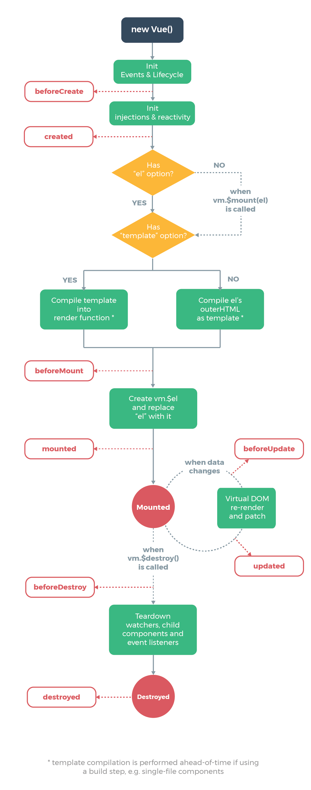

# 基础

## 介绍

Vue是一套用于构建用户界面的渐进式框架。与其它大型框架不同的是，Vue 被设计为可以自底向上逐层应用。Vue
的核心库只关注视图层，不仅易于上手，还便于与第三方库或既有项目整合。另一方面，当与现代化的工具链以及各种支持类库结合使用时，Vue
也完全能够为复杂的单页应用提供驱动。

[vue2官方指南](https://v2.cn.vuejs.org/)

[vue官方指南](https://cn.vuejs.org/)

CDN:

```html
<!-- Vue2 开发环境版本，包含了有帮助的命令行警告 -->
<script src="https://cdn.jsdelivr.net/npm/vue@2/dist/vue.js"></script>

<!-- Vue2 生产环境版本，优化了尺寸和速度 -->
<script src="https://cdn.jsdelivr.net/npm/vue@2"></script>
```

## Vue 数据

当一个 Vue 实例被创建时，它将 data 对象中的所有的 property 加入到 Vue 的响应式系统中。当这些 property
的值发生改变时，视图将会产生“响应”，即匹配更新为新的值。

```js
var vm = new Vue({
    data() {
        return {
            a: '1'
        }
    },

    method: {
        print() {
            console.log(a)
        }
    }
})
```

## 生命周期

每个 Vue 实例在被创建时都要经过一系列的初始化过程——例如，需要设置数据监听、编译模板、将实例挂载到 DOM 并在数据变化时更新
DOM 等。同时在这个过程中也会运行一些叫做生命周期钩子的函数，这给了用户在不同阶段添加自己的代码的机会。

比如 `created` 钩子可以用来在一个实例被创建之后执行代码：

```js
new Vue({
    data() {
        a: 1
    },

    created: function () {
        // `this` 指向 vm 实例
        console.log('a is: ' + this.a)
    }
})
// => "a is: 1"
```



> 不要在选项 property 或回调上使用箭头函数，比如 `created: () => console.log(this.a)`
> 或 `vm.$watch('a', newValue => this.myMethod())`。因为箭头函数并没有 `this`，`this`
> 会作为变量一直向上级词法作用域查找，直至找到为止，经常导致 `Uncaught TypeError: Cannot read property of undefined`
> 或 `Uncaught TypeError: this.myMethod is not a function` 之类的错误。

## 插值

### 文本

数据绑定最常见的形式就是使用&lbrace;&lbrace; &rbrace;&rbrace;语法的文本插值：

```vue
<span>Message: {{ msg }}</span>
```

&lbrace;&lbrace; &rbrace;&rbrace;标签将会被替代为对应数据对象上 msg property 的值。无论何时，绑定的数据对象上 msg property
发生了改变，插值处的内容都会更新。

通过使用 `v-once` 指令，也能执行一次性地插值，当数据改变时，插值处的内容不会更新。但请留心这会影响到该节点上的其它数据绑定：

```vue
<span v-once>这个将不会改变: {{ msg }}</span>
```

### 原始HTML

双大括号会将数据解释为普通文本，而非 HTML 代码。为了输出真正的 HTML，需要使用 `v-html` 指令：

```vue
<p>Using mustaches: {{ rawHtml }}</p>
<p>Using v-html directive: <span v-html="rawHtml"></span></p>
```

> 站点上动态渲染的任意 HTML 可能会非常危险，因为它很容易导致 XSS 攻击。请只对可信内容使用 HTML 插值，绝不要对用户提供的内容使用插值。

### 属性

双大括号不能作用在 HTML attribute 上，遇到这种情况应该使用 `v-bind` 指令：

```vue

<div v-bind:id="dynamicId"></div>
<button v-bind:disabled="isButtonDisabled">Button</button>
```

对于布尔 attribute (它们只要存在就意味着值为 true)，v-bind 工作起来略有不同，如果 isButtonDisabled 的值是 null、undefined 或
false，则 disabled attribute 甚至不会被包含在渲染出来的 `<button> `元素中。

### javaScript表达式

对于所有的数据绑定，Vue.js 都提供了完全的 JavaScript 表达式支持。

```vue
{{ number + 1 }}

{{ ok ? 'YES' : 'NO' }}

{{ message.split('').reverse().join('') }}

<div v-bind:id="'list-' + id"></div>
```

这些表达式会在所属 Vue 实例的数据作用域下作为 JavaScript 被解析。有个限制就是，每个绑定都只能包含单个表达式，所以下面的例子都不会生效。

```vue
<!-- 这是语句，不是表达式 -->
{{ var a = 1 }}

<!-- 流控制也不会生效，请使用三元表达式 -->
{{ if (ok) { return message } }}
```

> 模板表达式都被放在沙盒中，只能访问全局变量的一个白名单，如 `Math` 和 `Date` 。不应该在模板表达式中试图访问用户定义的全局变量。

## 指令

指令是带有 v- 前缀的特殊属性。指令属性的值预期是单个 JavaScript 表达式 (v-for 例外)。指令的职责是，当表达式的值改变时，将其产生的连带影响，响应式地作用于
DOM。

```vue
<p v-if="seen">现在你看到我了</p>
```

这里，`v-if` 指令将根据表达式 seen 的值的真假来插入/移除 `<p>` 元素。

### 参数

一些指令能够接收一个“参数”，在指令名称之后以冒号表示。例如，v-bind 指令可以用于响应式地更新 HTML 属性：

```vue
<a v-bind:href="url">...</a>
```

在这里 href 是参数，告知 `v-bind` 指令将该元素的 href 属性 与表达式 url 的值绑定。

```vue
<a v-on:click="doSomething">...</a>
```

`v-on` 指令，它用于监听 DOM 事件,在这里参数是监听的事件名。

### 动态参数

> 2.6新增特性

用方括号括起来的 JavaScript 表达式作为一个指令的参数：

```vue
<a v-bind:[attributeName]="url"> ... </a>
```

这里的 attributeName 会被作为一个 JavaScript 表达式进行动态求值，求得的值将会作为最终的参数来使用。例如，如果 Vue 实例有一个
data property attributeName，其值为 "href"，那么这个绑定将等价于 `v-bind:href`。

```vue
<a v-on:[eventName]="doSomething"> ... </a>
```

当 eventName 的值为 "focus" 时，`v-on:[eventName]` 将等价于 `v-on:focus`

**对动态参数的值的约束**

动态参数预期会求出一个字符串，异常情况下值为 null。这个特殊的 null 值可以被显性地用于移除绑定。任何其它非字符串类型的值都将会触发一个警告。

**对动态参数表达式的约束**

动态参数表达式有一些语法约束，因为某些字符，如空格和引号，放在 HTML attribute 名里是无效的。例如

```vue
<!-- 这会触发一个编译警告 -->
<a v-bind:['foo' + bar]="value"> ... </a>
```

变通的办法是使用没有空格或引号的表达式，或用计算属性替代这种复杂表达式。

在 DOM 中使用模板时 (直接在一个 HTML 文件里撰写模板)，还需要避免使用大写字符来命名键名，因为浏览器会把 attribute
名全部强制转为小写：

```vue
<!--
在 DOM 中使用模板时这段代码会被转换为 `v-bind:[someattr]`。
除非在实例中有一个名为“someattr”的 property，否则代码不会工作。
-->
<a v-bind:[someAttr]="value"> ... </a>
```

### 修饰符

修饰符是以半角句号 `.` 指明的特殊后缀，用于指出一个指令应该以特殊方式绑定。例如，`.prevent` 修饰符告诉 `v-on`
指令对于触发的事件调用 `event.preventDefault()`：

```vue

<form v-on:submit.prevent="onSubmit">...</form>
```

### 缩写

**`v-bind` 缩写**

```vue
<!-- 完整语法 -->
<a v-bind:href="url">...</a>

<!-- 缩写 -->
<a :href="url">...</a>

<!-- 动态参数的缩写 (2.6.0+) -->
<a :[key]="url"> ... </a>
```

**`v-on` 缩写**

```vue
<!-- 完整语法 -->
<a v-on:click="doSomething">...</a>

<!-- 缩写 -->
<a @click="doSomething">...</a>

<!-- 动态参数的缩写 (2.6.0+) -->
<a @[event]="doSomething"> ... </a>
```

它们看起来可能与普通的 HTML 略有不同，但 `:` 与 `@`对于 attribute 名来说都是合法字符，在所有支持 Vue
的浏览器都能被正确地解析。而且，它们不会出现在最终渲染的标记中。

## 计算属性和侦听器

### 计算属性

```html

<div id="example">
    <p>Original message: "{{ message }}"</p>
    <p>Computed reversed message: "{{ reversedMessage }}"</p>
</div>
```

```js
var vm = new Vue({
    el: '#example',
    data: {
        message: 'Hello'
    },
    computed: {
// 计算属性的 getter
        reversedMessage() {
// `this` 指向 vm 实例
            return this.message.split('').reverse().join('')
        }
    }
})
```

上面的例子中，声明了一个计算属性 reversedMessage。提供的函数将用作 property vm.reversedMessage 的 getter 函数，可以像绑定普通
property 一样在模板中绑定计算属性。Vue 知道 vm.reversedMessage 依赖于 vm.message，因此当 vm.message 发生改变时，所有依赖
vm.reversedMessage 的绑定也会更新。

#### 计算属性的setter

```js
// ...
computed: {
    fullName: {
        get() {
            return this.firstName + ' ' + this.lastName
        }
        set(newValue) {
            var names = newValue.split(' ')
            this.firstName = names[0]
            this.lastName = names[names.length - 1]
        }
    }
}
```

现在 vm.fullName 被修改时，setter 会被调用，vm.firstName 和 vm.lastName 也会相应地被更新。

### 侦听器

```js
var vm = new Vue({
    el: '#example',
    data: {
        message: 'Hello',
        reversedMessage: 'olleH'
    },
    watch: {
        // 如果message属性发生变化，这个函数就会运行
        message(newVal, oldVal) {
            this.reversedMessage = newVal.split('').reverse().join('')
        }
    }
})
```

### 计算属性缓存 vs 方法

可以将同一函数定义为一个方法而不是一个计算属性。两种方式的最终结果确实是完全相同的。然而，不同的是计算属性是基于它们的响应式依赖进行缓存的。只在相关响应式依赖发生改变时它们才会重新求值。

### 计算属性 vs 侦听属性

虽然计算属性在大多数情况下更合适，但有时也需要一个自定义的侦听器。这就是为什么 Vue 通过 watch 选项提供了一个更通用的方法，来响应数据的变化。当需要在数据变化时执行异步或开销较大的操作时，这个方式是最有用的。
侦听器能获取变化前的数据


